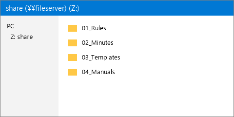

<!--
  ■ このファイルの使い方
  このファイルをコピーして、中身を書き換えて使ってください。
  「変換.bat」をダブルクリックすると、同じフォルダの .md が HTML と Excel に変換されます。
  （.md ファイルを「変換.bat」にドラッグ＆ドロップして、そのファイルだけ変換することもできます）

  ■ 先頭の --- で囲まれた部分（Front Matter）
  title  : 手順書のタイトル（必須）
  date   : 作成日（省略すると変換した日の日付になります）
  update : 更新日
  author : 作成者
  「キー: 値」の形で書きます。値は "" で囲んでください。

  ※ このように「＜!--」と「--＞」（どちらも半角）で囲んだ部分はコメントです。変換後の HTML・Excel には出力されません。
     説明が不要になったら消してかまいません。
-->

この手順書では、社内の共有フォルダを Z ドライブとして使えるようにする方法を説明します。

<!--
  ■ 最初の「#」より前の文章 … 手順書の前書き（概要）になります。
-->

# 準備

<!--
  ■ 「# 見出し」… 大項目です。手順をいくつかのまとまりに分けるときに使います。
-->

## 共有フォルダの場所を確認する

<!--
  ■ 「## 見出し」… 手順です。1つの「##」が Excel の1行になります。
     見出しは「～する」のように、やることを短く書くのがおすすめです。

  ■ 見出しの直後の文章・番号付きリスト … 操作手順になります。
     番号付きリストは「1.」「2.」…と書きます。
-->

1. 管理者から届いたメールを開きます。
2. メールに書かれている共有フォルダの場所（例: `\\fileserver\share`）を控えます。

> **期待値**
> 共有フォルダの場所（`\\` から始まる文字列）が手元に控えてあること。

<!--
  ■ 行頭に半角の「＞」を付けた部分（引用）… 期待される結果（確認ポイント）になります。
     1行目の「**期待値**」は見出しとして扱われ、出力には出ません。
     2行目以降の各行にも、行頭に半角の「＞」を付けてください。
-->

# ネットワークドライブの割り当て

## コマンドプロンプトを開く

1. キーボードの **Windows キー** を押します。
2. `cmd` と入力し、**コマンド プロンプト** をクリックします。

> **期待値**
> 黒い画面（コマンドプロンプト）が開くこと。

## ドライブを割り当てる

1. 次のコマンドを入力し、**Enter** キーを押します。
   ```
   net use Z: \\fileserver\share /persistent:yes
   ```
2. ユーザー名とパスワードを聞かれた場合は、社内アカウントの情報を入力します。

<!--
  ■ コマンドや設定値は「```」で囲むと、コードとして表示されます。
     番号付きリストの中に書くときは、行頭を半角スペース3つ分さげます。
-->

> **期待値**
> 「コマンドは正常に終了しました。」と表示されること。

## エクスプローラーで確認する

1. エクスプローラーを開き、左側の **PC** をクリックします。
2. **Z:** ドライブをダブルクリックします。

> **期待値**
> 共有フォルダの中身が表示されること。
>
> 

<!--
  ■ 画像は「」と書きます。
     画像ファイルは images フォルダに入れてください。
     ・HTML では、画像がファイルの中に埋め込まれます（HTML 1つだけ配れば見られます）。
     ・Excel では、期待値の中の最初の画像が、その手順の行に貼り付けられます。
     ・Excel に貼り付けられる形式は PNG・JPEG・GIF です。
-->

## 後片付け

作業が終わったら、コマンドプロンプトを閉じます。

<!--
  ■ 期待値（行頭の「＞」）は省略してもかまいません。
-->
